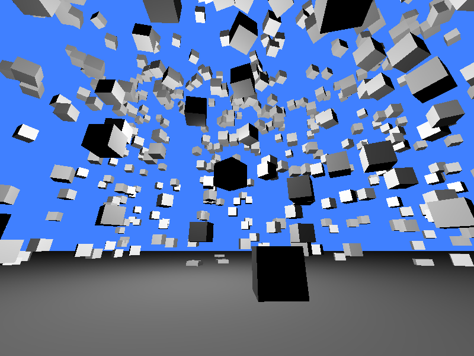

# Sample game
This is a sample game using my custom made engine
[gnidEngine](https://github.com/tcannon686/gnidEngine). Right now it is just a
scene that can be walked around in using FPS controls. It spawns random boxes
around the map for the player to jump on. It is somewhat minimalistic, but
should be a good representation of the engine's current abilities, and a
starting point for building more complex projects.

## Building
Download and install the dependencies, then run `make`. This will output
build/game which you can then run.

## Dependencies
 - GLFW3
 - OpenGL
 - [gnidEngine](https://github.com/tcannon686/gnidEngine)

